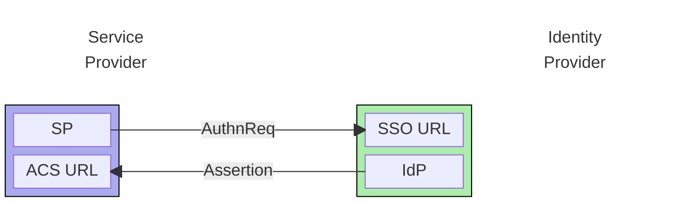
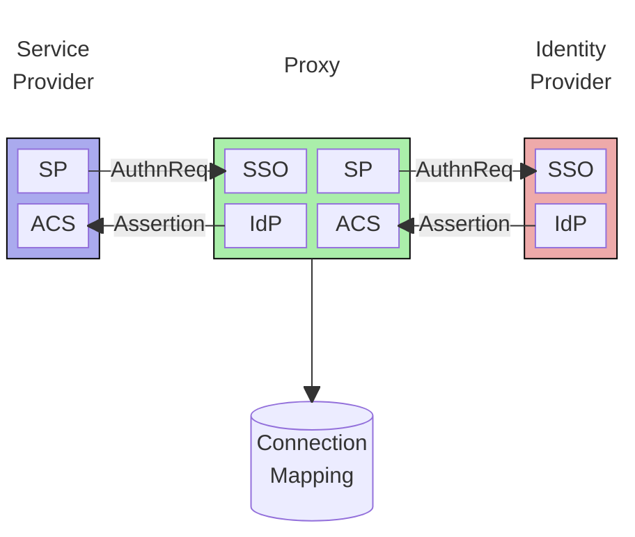

_TL;DR Adopting an Infrastructure As A Service (IaaS) provider can save huge time and effort
when implementing a B2B SaaS product, but it can result in deep lock-in with the provider.
I explain how deploying a SAML Proxy can mitigate this, and provide a case study of
migrating hundreds of customers from one IaaS provider to a competitor instantly and
with zero disruption._

* [How Does IaaS Lock-in Happen?](#how-does-iaas-lock-in-happen)
* [How a SAML Proxy Can Help](#how-a-saml-proxy-can-help)
* [Introducing SAML Proxy](#introducing-saml-proxy)

### How Does IaaS Lock-in Happen?

Any successful B2B SaaS product has to offer "enterprise SSO" - which usually
means SAML authentication - to its customers. Unfortunately knowledge of SAML
authentication protocols is quite specialist, and the risks of a poorly
implemented SAML Service Provider (SP) compromising your security are high. Add
to that the cost of a custom implementation and it rapidly becomes obvious that
using a 3rd party authentication service makes sense. These often include
identity management and role based access control, and make a compelling time
saver for a new business.

Identity as a Service (IaaS) has unsurprisingly emerged as a very popular SaaS
category with a number of competing providers. A list off the top of my head
would include Okta (and Auth0), AWS Cognito, WorkOS, and Clerk.

There is a danger of course with adopting an IaaS, and that it inevitably means
very deep lock-in with the IaaS vendor. This has multiple dimentions, especially
if you adopt them for full identity/role management, but for this blog post I
want to focus on just one aspect, enterpise SSO using the SAML protocol.

A SAML SSO connection has two parties: the Service Provider (SP), and the
Identity Provider (IdP). The SP is your application that trusts an IdP to
authenticate users on its behalf, but if you've delegated authentication to a
3rd party IaaS, your SP will be hosted by them. The IdP can be an in-house
implementation, but more commonly it will be provided by a 3rd party like Okta,
Google, or Microsoft. A SAML connection between an SP and an IdP is configured
at both ends, so if you want to change the IdP or SP, both ends of the
connection will need to be reconfigured.

At a minimum the service provider (or IaaS) will need to be configured with:

| | |
| --- | --- |
| __IdP SSO URL__ | This is the endpoint at the IdP that receives the `AuthnRequest` (request for authentication). These paths are vendor specific and often include a unique string for each connection |
| __IdP Entity Id__ | This is a unique identifier for the IdP. Most IdPs will specifiy a unique Entity Id for each SP connection |
| __IdP X509 Certificate__ | This is the IdP's public encryption key that the SP will use to validate the assertion's X509 signature. IdPs will usually provide a unique certificate for each SP connection |

The Identity Provider's minimal configuration for each SP that it provides
authentication for is:

| | |
| --- | --- |
| __SP ACS URL__ | This is the SP's Assertion Consumer Service, the endpoint that recieves the SAML Assertion from the IdP. Most IaaS services will provide a unique URL for each IdP connection |
| __SP Entity Id__ | This is a unique identifier for the SP and will often be unique per connection. |

I've worked with three separate IaaS services: AWS Cognito, Auth0, and Clerk.
All provide a management API that allows one to query their service provider
configuration, so in theory, if one were to migrate from one IaaS to another,
one could simply extract the configuration from, say, Cognito, and apply it to,
for example, Clerk. The problem is that your new SP (IaaS) will have a different
ACS URL and a different Entity Id since these are vendor specific. So even if
one could make a request for authentication to an IdP, it would be at minimum
rejected because of an unmatched Entity Id, or, even if that wasn't an issue,
the SAML Assertion would be sent to the wrong ACS URL. One has no alternative
but to contact each customer in turn and request that they reconfigure their
IdP to point to your new IaaS provider. For a company with hundreds, or even
thousands of customers, each with their own IdP configration, this is a huge
ask.

### How a SAML Proxy Can Help

_Introduce the idea of a SAML proxy_

_I was part of a team which migrated several hundred customers away from Auth0 and Cognito using this method._

### Introducing SAML Proxy

