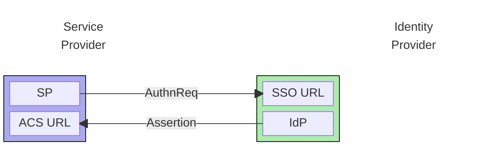
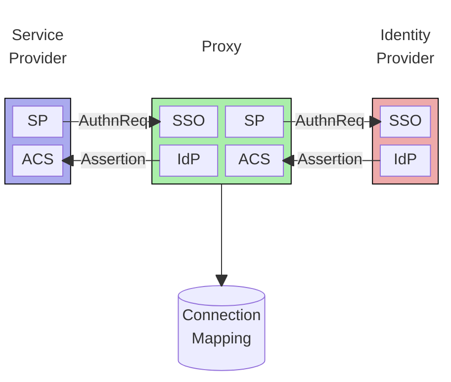

_TL;DR Adopting an Identity As A Service (IaaS) provider can save huge
time and effort when implementing a B2B SaaS product, but it can also result in
deep lock-in with the provider. I explain how deploying a SAML Proxy can
mitigate this, and provide a case study of migrating hundreds of customers from
one IaaS provider to a competitor instantly and with near zero disruption. I
also introduce my new open source [SAML
Proxy](https://github.com/mikehadlow/samlproxy), a fully functional demo that
you can try out yourself and modify for your own custom scenarios._

* [How Does IaaS Lock-in Happen?](#how-does-iaas-lock-in-happen)
* [How a SAML Proxy Can Help](#how-a-saml-proxy-can-help)
* [Case Study](#case-study)
* [Introducing SAML Proxy](#introducing-saml-proxy)

### How Does IaaS Lock-in Happen?

Any successful B2B SaaS product has to offer "enterprise SSO" - which usually
means SAML authentication - to its customers. Unfortunately knowledge of SAML
authentication protocols is somewhat specialist, and the risks of a poorly
implemented SAML Service Provider (SP) compromising your security are high. Add
to that the cost of a custom implementation and it rapidly becomes obvious that
using a 3rd party authentication service makes sense. These often include
identity management and role based access control, and make a compelling time
saver for a new business.

Identity as a Service (IaaS) has unsurprisingly emerged as a very popular SaaS
category with a number of competing providers. A list off the top of my head
would include Okta (and Auth0), AWS Cognito, WorkOS, and Clerk.

There is a danger of course with adopting an IaaS, that it inevitably means deep
coupling (lock-in) with the IaaS vendor, making it technically difficult to switch to a
different provider. This has multiple dimensions, especially if you adopt them
for full identity/role management, but for this blog post I want to focus on
just one aspect, enterprise SSO using the SAML protocol.

A SAML SSO connection has two parties: the Service Provider (SP), and the
Identity Provider (IdP). The SP is your application that trusts an IdP to
authenticate users on its behalf, but if you've delegated authentication to a
3rd party IaaS, your SP will be hosted by them. The IdP can be your customer's
in-house implementation, but more commonly it will be provided on their behalf
by a 3rd party like Okta, Google, or Microsoft. The lock-in happens because A
SAML connection between an SP and an IdP is configured at both ends, so if you
want to change the IdP or SP, both ends of the connection will need to be
reconfigured, but you, as the SP, have no control over the IdP configuration.

At a minimum the service provider (or IaaS) will need to be configured with:

| | |
| --- | --- |
| __IdP SSO URL__ | This is the endpoint at the IdP that receives the `AuthnRequest` (request for authentication). These paths are vendor specific and often include a unique string for each connection |
| __IdP Entity Id__ | This is a unique identifier for the IdP. Most IdPs will specify a unique Entity Id for each SP connection |
| __IdP X509 Certificate__ | This is the IdP's public encryption key that the SP will use to validate the assertion's X509 signature. IdPs will usually provide a unique certificate for each SP connection |

This configuration will typically be exported from the IdP as an XML document
called "Metadata XML". Often it's given as a public URL that most IaaS providers
will accept in their management console.

The Identity Provider's minimal configuration for each SP that it provides
authentication for is:

| | |
| --- | --- |
| __SP ACS URL__ | This is the SP's Assertion Consumer Service, the endpoint that receives the SAML Assertion from the IdP. Most IaaS services will provide a unique URL for each IdP connection |
| __SP Entity Id__ | This is a unique identifier for the SP and will often be unique per connection. |

I've worked with three separate IaaS services: AWS Cognito, Auth0, and Clerk.
All provide a management API that allows one to query their service provider
configuration, so in theory, if one were to migrate from one IaaS to another,
one could simply extract the configuration from, say, Cognito, and apply it to,
for example, Clerk. The problem is that your new SP (IaaS) will have a different
ACS URL and a different Entity Id since these are vendor specific. So even if
one could make a request for authentication to an IdP, it would at minimum be
rejected because of an unmatched Entity Id, or, even if that wasn't an issue,
the SAML Assertion would be sent to the wrong ACS URL.

This is the core issue with any migration: _One has no alternative but to
contact each customer in turn and request that they reconfigure their IdP to
point to your new IaaS provider. For a company with hundreds, or even thousands
of customers, each with their own IdP configuration, this is a huge ask._

### How a SAML Proxy Can Help

A SAML IdP Proxy is a stand-alone service that sits between an SP and an IdP. It
can route, modify, log, and enhance SAML interactions, but most importantly for
our discussion it decouples the SP from the IdP and allows seamless migration
between different SPs and IdPs without needing to reconfigure the peer.

The SAML Proxy acts as an IdP to your SP, and an SP to your IdP, and provides a
mapping between them. See the diagram below:

Because you have full control over the SAML Proxy's configuration you can freely
reconnect SPs to IdPs and IdPs to SPs, or even multiplex single SPs to multiple
IdPs using whatever attributes you want (and vice-versa of course). Ideally you
would implement a SAML Proxy when adopting an IaaS solution, but failing that it
is possible to retroactively insert one between your SP/IaaS and your customers
IdPs, the case study below explains how.

### Case Study

I was part of a team which migrated several hundred customers away from Auth0
and Cognito using this method. The company was a B2B start-up that had been
growing for several years as a monolithic single application. They had several
hundred customers configured with SAML connections via AWS Cognito and Auth0.
Cognito had been the original choice since the company was wholly based on AWS
infrastructure, but a missing feature in Cognito had led to Auth0 integration
being used for around 80 customers.

Two main factors forced a review of how authentication was implemented:

1. The company was moving to a distributed application model with several
   applications that needed seamless authentication between them. Refactoring
   the monolith's authentication logic and UI was seen as impractical when there
   are so many IaaS solutions that provide the same functionality
   out-of-the-box.
1. Auth0 was proving to be very expensive.

After considering a number of competing options it was decided to adopt Clerk as
the IaaS for all current and future applications. One compelling feature was
Clerk's provision of React authentication UI components that could simply be
dropped into new applications as needed.

It was at this point that the question of how to migrate the company's SAML
customers to Clerk arose. Somebody suggested using a SAML Proxy, but after some
investigation we were surprised to find that there were no open-source or
commercial options available. I volunteered to build one based around the
excellent [Samlify](https://samlify.js.org/#/) library.

I was able to extract the SP configuration from Cognito and Auth0 using their
management APIs, and because I was building the Proxy, it was simple to provide
endpoints that mimicked their ACS endpoints. We had configured both our Cognito
and Auth0 tenants with custom company sub domains; something like
`auth.acme.com`, so all we needed was a DNS reconfiguration to point all our
customers at once to our proxy rather than Cognito and Auth0. Since we were
adopting Clerk as a new service it was simple to configure it from scratch to
point to our SAML Proxy. Each customer had a unique connection in Clerk which
pointed to a unique connection in the proxy which then mapped to the customer's
IdP. Simple!

Of course it wasn't _that_ simple. There was much to learn during the process. One
of the biggest difficulties was our inability to do much realistic testing
before the DNS switch. Ultimately it was successful though; we migrated several hundred
SAML customers to Clerk in two batches, one each for Cognito and Auth0.

### Introducing SAML Proxy

The SAML proxy I built for the company in the case study was their proprietary
code, but since then I've built a generic [open source SAML
Proxy](https://github.com/mikehadlow/samlproxy) with an entirely new codebase.

Here is it in action:

The GitHub repository for the proxy, called, imaginatively "SAML Proxy" is at
[https://github.com/mikehadlow/samlproxy](https://github.com/mikehadlow/samlproxy).
There are full instructions on how to clone it and run it. It also includes a
demo SP and IdP, which could serve as a starting point, especially if you want
to add SAML authentication to your existing application, but don't want to pay
for an IaaS provider. It's provided as a demo, so you'll need to do some work to
alter it for your own needs, but hopefully it'll save you considerable time.
It has an MIT license, so you are free to take the code and use it
however you wish. I'd be very curious to hear about any actual implementations,
so please let me know if you can.

Happy Proxying!
